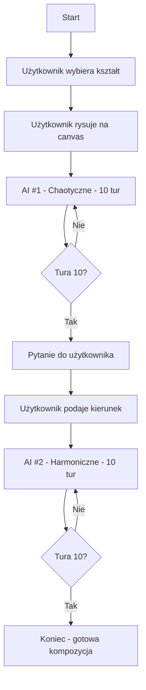
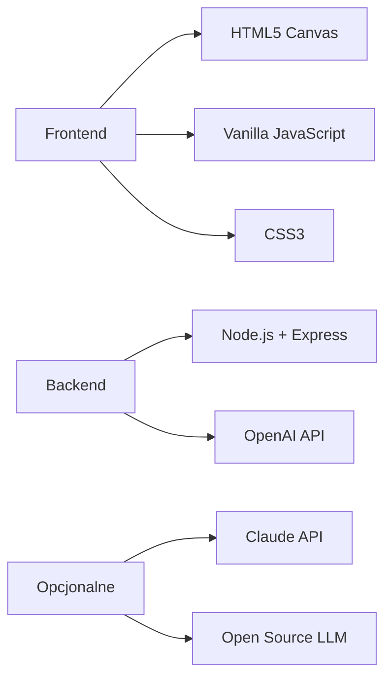

# AI Drawing Chaos - Przegląd Projektu

## 🎯 Cel Aplikacji

**AI Drawing Chaos** to interaktywna gra rysunkowa łącząca kreatywność człowieka z nieprzewidywalnością sztucznej inteligencji. Aplikacja jest cyfrową implementacją surrealistycznej techniki "Cadavre Exquis" (Zwłoki w Rozkładzie), gdzie użytkownik i AI współtworzą kompozycję artystyczną.

## 🎨 Koncepcja

Aplikacja symuluje proces twórczy, w którym:
- Użytkownik inicjuje kompozycję prostym kształtem
- Dwa AI o różnych "osobowościach" rozwijają dzieło
- Proces jest iteracyjny i pełen niespodzianek
- Nie ma z góry określonego "celu" - wartość leży w procesie

## 🔄 Przepływ Gry

## 🧩 Kluczowe Elementy

### Podstawowe Kształty
Aplikacja ogranicza się do 5 podstawowych kształtów geometrycznych:
- **Koło** (circle)
- **Prostokąt** (rectangle)  
- **Linia** (line)
- **Trójkąt** (triangle)
- **Elipsa** (ellipse)

### Właściwości Kształtów
Każdy kształt może mieć następujące właściwości:
- Pozycja (x, y)
- Rozmiar (radius, width, height, length)
- Kolor (hex)
- Rotacja (0-360°)
- Przezroczystość (0-1)
- Wypełnienie (boolean)

### Osobowości AI

#### AI #1: Chaotyczne
- **Cel**: Wprowadzenie napięcia i kontrastów
- **Zachowanie**: 
  - Losowe zmiany kolorów
  - Nieprzewidywalne rotacje
  - "Zaprzeczanie" poprzednim decyzjom
  - Tworzenie dysharmonii

#### AI #2: Harmoniczne
- **Cel**: Balansowanie kompozycji
- **Zachowanie**:
  - Kontynuacja wzorów
  - Szukanie symetrii
  - Uzupełnianie luk
  - Tworzenie spójności

## 🛠️ Technologie

## 📊 Wartość Początkowa

Wartością początkową aplikacji jest **pusty canvas** oraz **intencja użytkownika** wyrażona pierwszym kształtem. To minimalistyczne podejście:
- Nie narzuca kierunku
- Pozostawia przestrzeń na emergencję
- Pozwala AI interpretować i rozwijać
- Odzwierciedla filozofię "less is more"

## 🎯 Unikalność Projektu

1. **Ograniczenia jako feature**: Zakaz złożonych kształtów wymusza kreatywność
2. **Dwie perspektywy AI**: Chaotyczna vs harmoniczna tworzy dynamikę
3. **Interakcja człowiek-AI**: Użytkownik kieruje, AI wykonuje
4. **Proces > Rezultat**: Wartość w podróży twórczej, nie celu

