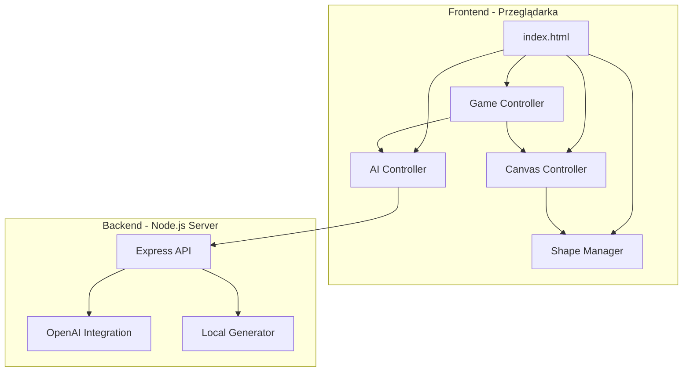
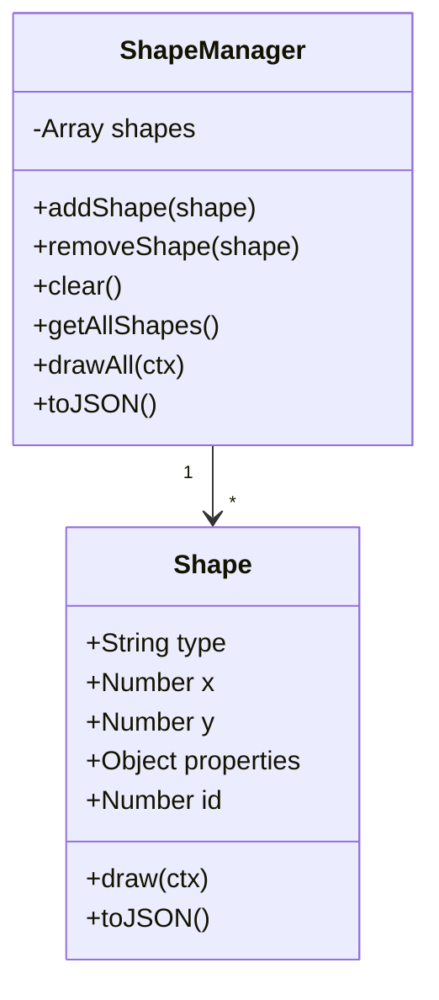
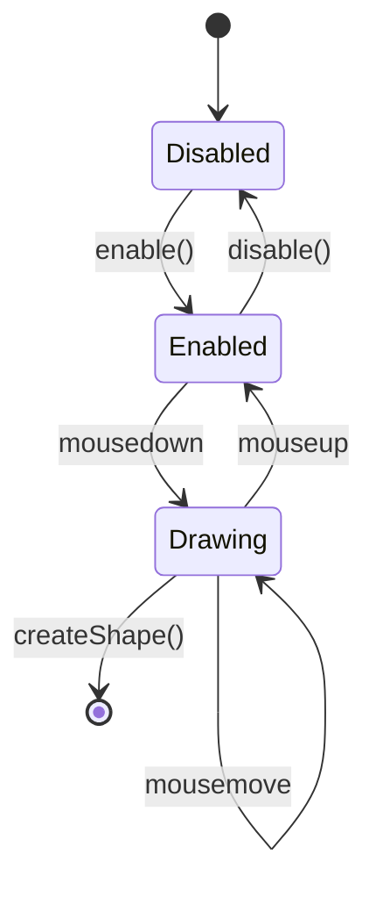
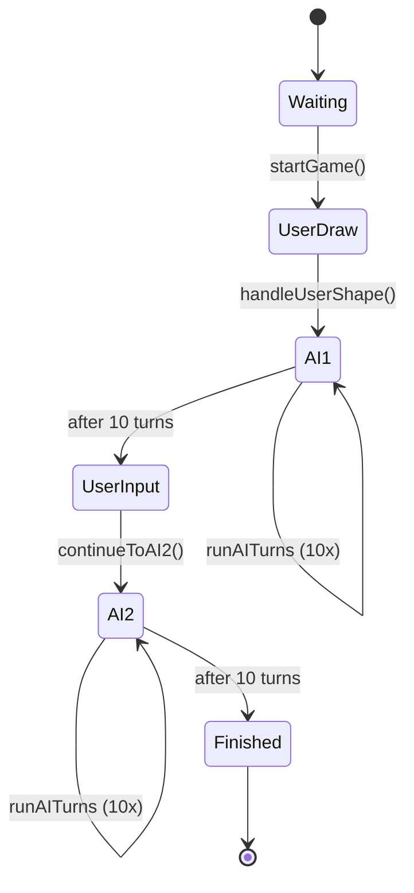
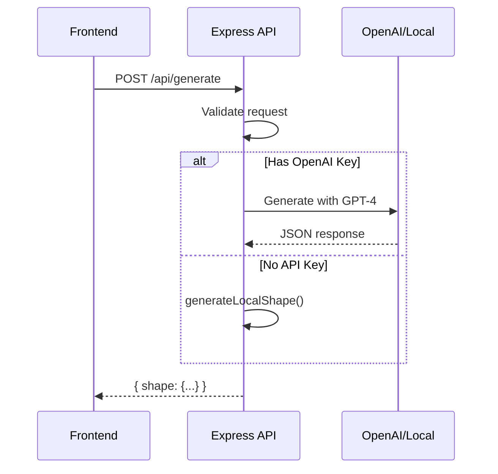
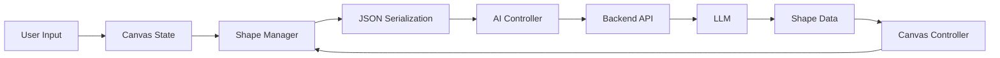

# Architektura Aplikacji

## 🏗️ Architektura Wysokiego Poziomu



## 📁 Struktura Projektu

```
/
├── index.html              # Główna strona aplikacji
├── package.json           # Zależności Node.js
├── .env.example          # Przykładowa konfiguracja
├── .gitignore            # Ignorowane pliki
│
├── css/
│   └── style.css         # Style aplikacji
│
├── js/
│   ├── shapes.js         # System zarządzania kształtami
│   ├── canvas.js         # Obsługa Canvas API
│   ├── ai.js             # Klient API dla AI
│   └── game.js           # Główna logika gry
│
├── server/
│   └── index.js          # Backend API
│
├── docs/
│   ├── 01-overview.md    # Przegląd projektu
│   ├── 02-architecture.md # Architektura (ten plik)
│   ├── 03-api.md         # Dokumentacja API
│   └── 04-game-flow.md   # Szczegóły przepływu gry
│
└── README.md             # Główne README
```

## 🎨 Frontend - Komponenty

### 1. Shape Manager (`shapes.js`)

Odpowiedzialny za definicję i renderowanie kształtów.



**Kluczowe metody:**
- `draw(ctx)` - Renderuje kształt na canvas
- `toJSON()` - Serializacja do wysłania do API

### 2. Canvas Controller (`canvas.js`)

Zarządza interakcją użytkownika z Canvas.



**Kluczowe metody:**
- `handleMouseDown/Move/Up()` - Obsługa rysowania
- `createShape()` - Tworzenie kształtu z gestu użytkownika
- `addAIShape()` - Dodawanie kształtu od AI
- `getCanvasState()` - Eksport stanu do JSON

### 3. AI Controller (`ai.js`)

Komunikacja z backend API i generowanie ruchów AI.

**Funkcje:**
- `generateMove()` - Wysyła zapytanie do API
- `buildPrompt()` - Konstruuje prompt dla LLM
- `generateLocalMove()` - Fallback bez API

### 4. Game Controller (`game.js`)

Orkiestruje cały przepływ gry.



## 🔧 Backend - Struktura

### Express Server (`server/index.js`)



**Endpointy:**
- `POST /api/generate` - Generuje ruch AI
- `GET /api/health` - Status serwera

## 🔄 Przepływ Danych



## 🎯 Separacja Odpowiedzialności

| Komponent | Odpowiedzialność | Zależności |
|-----------|-----------------|-----------|
| **Shape** | Definicja i renderowanie pojedynczego kształtu | Brak |
| **ShapeManager** | Zarządzanie kolekcją kształtów | Shape |
| **CanvasController** | Interakcja canvas, eventy myszy | ShapeManager |
| **AIController** | Komunikacja z API, generowanie | Brak |
| **GameController** | Orkiestracja gry, stan | Wszystkie powyższe |
| **Express API** | Obsługa requestów, integracja LLM | OpenAI SDK |

## 🔐 Bezpieczeństwo

- **API Key**: Przechowywany w `.env`, nigdy w kodzie
- **CORS**: Włączony dla lokalnego developmentu
- **Walidacja**: Sprawdzanie formatów shape JSON
- **Fallback**: Lokalne generowanie gdy API niedostępne

## ⚡ Optymalizacja

1. **Canvas Rendering**: Redraw tylko gdy potrzebne
2. **API Calls**: Throttling między turami AI (600-800ms delay)
3. **State Management**: Minimalna struktura danych
4. **Memory**: Limit historii ruchów (scroll container)

