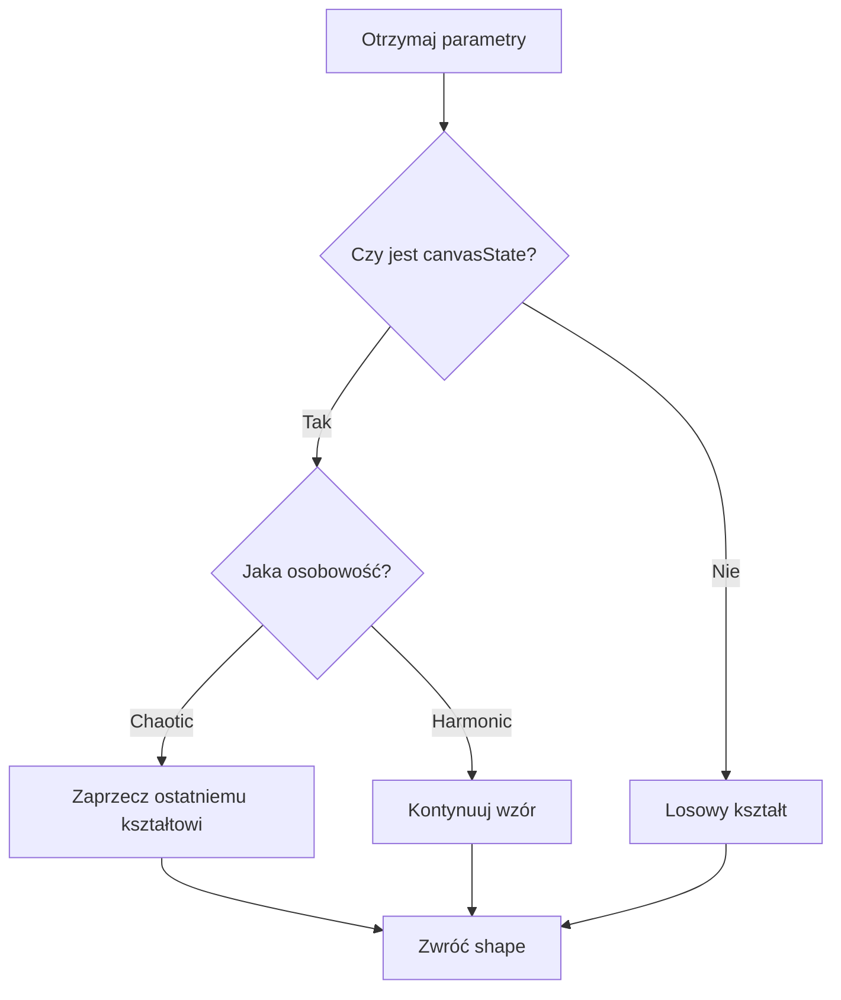
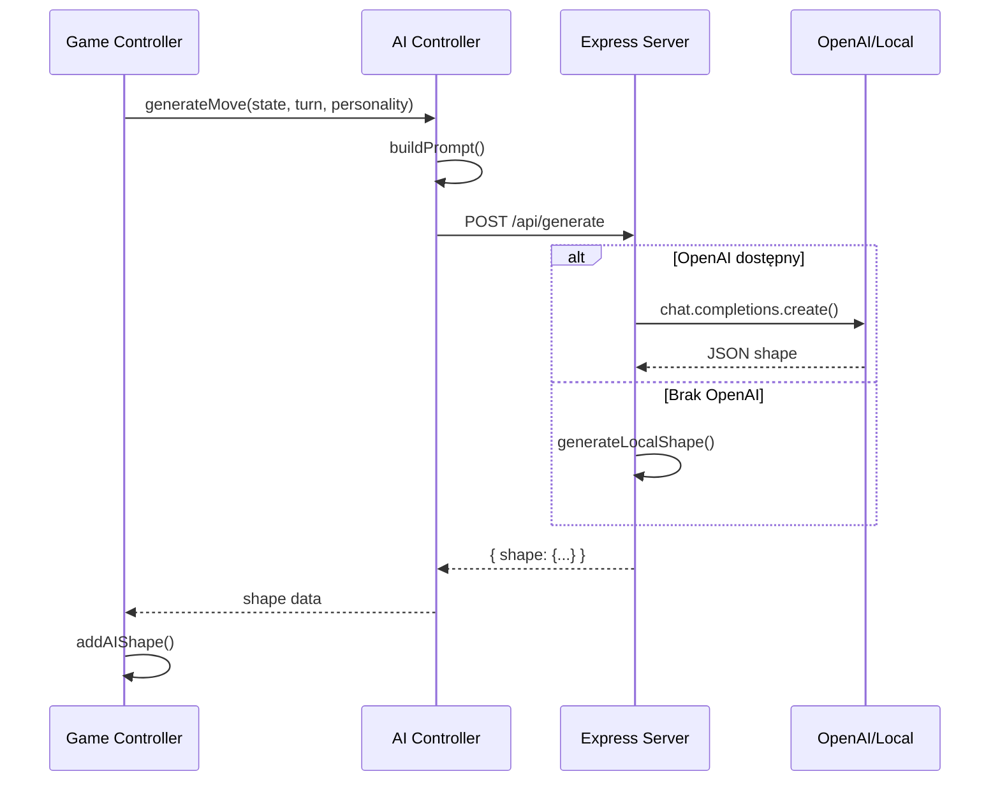

# Dokumentacja API

## 🌐 Backend API

Backend serwer działa na **Express.js** i obsługuje generowanie ruchów AI oraz statyczne pliki frontendu.

## 📍 Endpointy

### 1. POST `/api/generate`

Generuje ruch AI na podstawie obecnego stanu canvas.

#### Request

```json
{
  "prompt": "string - pełny prompt dla LLM",
  "canvasState": [
    {
      "type": "circle|rectangle|line|triangle|ellipse",
      "x": 100,
      "y": 150,
      "properties": {
        "color": "#FF6B6B",
        "radius": 50,
        "opacity": 0.8,
        "filled": true
      }
    }
  ],
  "turn": 1,
  "personality": "chaotic|harmonic"
}
```

#### Response

```json
{
  "shape": {
    "type": "circle",
    "x": 250,
    "y": 300,
    "properties": {
      "color": "#4ECDC4",
      "radius": 40,
      "opacity": 0.9,
      "filled": true,
      "rotation": 45
    },
    "reasoning": "Wprowadzam chaos przez kontrast kolorów"
  }
}
```

#### Kody Statusu

- `200 OK` - Sukces, zwrócono kształt
- `500 Internal Server Error` - Błąd, ale zwrócono fallback shape

---

### 2. GET `/api/health`

Sprawdza status serwera i dostępność API.

#### Response

```json
{
  "status": "ok",
  "hasOpenAI": true,
  "message": "Using OpenAI API"
}
```

lub

```json
{
  "status": "ok",
  "hasOpenAI": false,
  "message": "Using local generation"
}
```

---

## 🤖 Integracja z LLM

### OpenAI GPT-4

Gdy `OPENAI_API_KEY` jest skonfigurowany w `.env`:

```javascript
const completion = await openai.chat.completions.create({
    model: "gpt-4-turbo-preview",
    messages: [
        {
            role: "system",
            content: "Jesteś AI artystą. Zwracaj TYLKO poprawny JSON..."
        },
        {
            role: "user",
            content: prompt
        }
    ],
    response_format: { type: "json_object" },
    temperature: personality === 'chaotic' ? 1.2 : 0.7,
});
```

**Parametry:**
- `temperature`: 
  - `1.2` dla chaotycznego AI (więcej kreatywności)
  - `0.7` dla harmonicznego AI (bardziej przewidywalne)
- `response_format`: Wymusza JSON output

### Lokalne Generowanie (Fallback)

Gdy brak OpenAI API key, używana jest funkcja `generateLocalShape()`:



**Algorytm harmonicznego AI:**
1. Pobierz ostatni kształt z canvasState
2. 50% szans na użycie tego samego koloru
3. Umieść nowy kształt blisko poprzedniego (offset 50-100px)

**Algorytm chaotycznego AI:**
1. Co 4 tury: odwróć kolor poprzedniego kształtu
2. Losowa rotacja
3. Zmienna przezroczystość (0.3-1.0)

---

## 📝 Format Kształtu

### Właściwości wspólne

```typescript
interface BaseShape {
  type: 'circle' | 'rectangle' | 'line' | 'triangle' | 'ellipse';
  x: number;        // Pozycja X (0-800)
  y: number;        // Pozycja Y (0-600)
  properties: {
    color: string;      // Hex color
    opacity: number;    // 0-1
    filled: boolean;    // Czy wypełniony
    rotation?: number;  // 0-360 stopni
  };
}
```

### Właściwości specyficzne

#### Circle
```typescript
{
  properties: {
    radius: number;  // Promień koła
  }
}
```

#### Rectangle
```typescript
{
  properties: {
    width: number;   // Szerokość
    height: number;  // Wysokość
  }
}
```

#### Line
```typescript
{
  properties: {
    length: number;    // Długość linii
    lineWidth: number; // Grubość linii
    filled: false;     // Zawsze false
  }
}
```

#### Triangle
```typescript
{
  properties: {
    size: number;  // Rozmiar trójkąta
  }
}
```

#### Ellipse
```typescript
{
  properties: {
    radiusX: number;  // Promień X
    radiusY: number;  // Promień Y
  }
}
```

---

## 🔄 Przepływ API Request



---

## 🛠️ Konfiguracja

### Zmienne środowiskowe (`.env`)

```bash
# OpenAI API Key (opcjonalne)
OPENAI_API_KEY=sk-...

# Port serwera (opcjonalne, domyślnie 3000)
PORT=3000
```

### Uruchomienie serwera

```bash
# Instalacja zależności
npm install

# Uruchomienie
npm start

# Development z auto-reload
npm run dev
```

---

## 🧪 Testowanie API

### cURL

```bash
# Health check
curl http://localhost:3000/api/health

# Generate move
curl -X POST http://localhost:3000/api/generate \
  -H "Content-Type: application/json" \
  -d '{
    "prompt": "Test prompt",
    "canvasState": [],
    "turn": 1,
    "personality": "chaotic"
  }'
```

### JavaScript (Frontend)

```javascript
const response = await fetch('http://localhost:3000/api/generate', {
    method: 'POST',
    headers: { 'Content-Type': 'application/json' },
    body: JSON.stringify({
        prompt: aiPrompt,
        canvasState: shapes,
        turn: currentTurn,
        personality: 'harmonic'
    })
});

const data = await response.json();
console.log(data.shape);
```

---

## ⚠️ Obsługa Błędów

API zawsze zwraca odpowiedź, nawet w przypadku błędu:

1. **Błąd OpenAI API** → Fallback do lokalnego generowania
2. **Błąd parsowania JSON** → Zwrócenie prostego kształtu
3. **Timeout** → Lokalne generowanie po 5s

Dzięki temu gra działa zawsze, niezależnie od dostępności zewnętrznych API.

