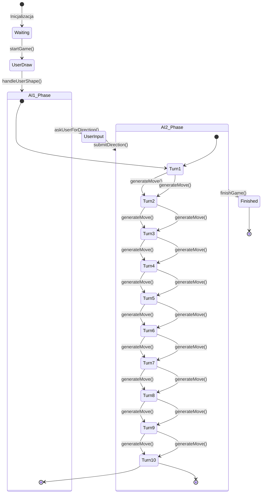
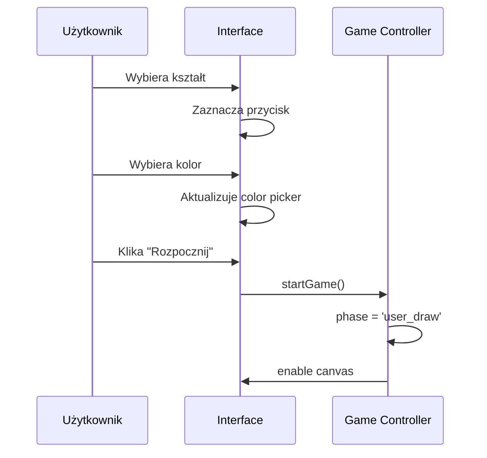
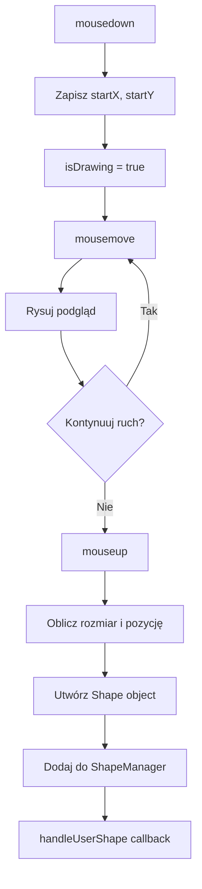
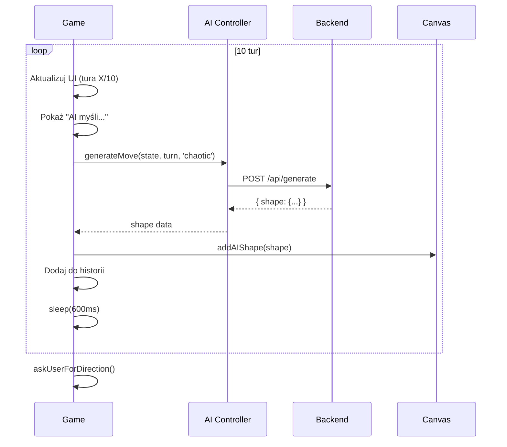
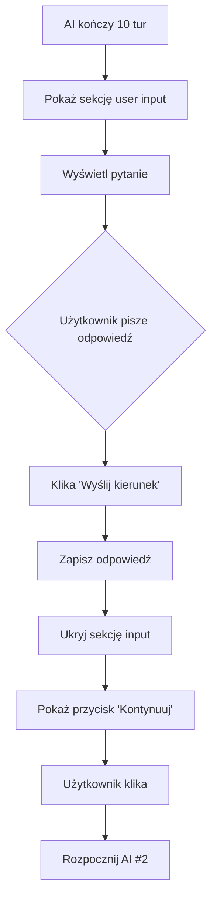
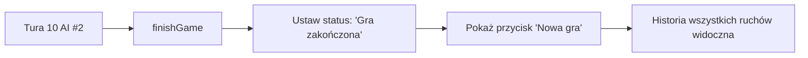

# Przepływ Gry

## 🎮 Szczegółowy Przebieg Gry

### Diagram Stanu Gry



---

## 📋 Fazy Gry

### Faza 1: Inicjalizacja (Waiting)

**Stan UI:**
- Przyciski wyboru kształtu aktywne
- Selektor koloru aktywny
- Canvas nieaktywny
- Przycisk "Rozpocznij grę" widoczny

**Akcje użytkownika:**
1. Wybór kształtu (circle/rectangle/line/triangle/ellipse)
2. Wybór koloru
3. Kliknięcie "Rozpocznij grę"



---

### Faza 2: Rysowanie Użytkownika (UserDraw)

**Stan UI:**
- Canvas aktywny (cursor: crosshair)
- Kształt i kolor wybrane
- Status: "Narysuj pierwszy kształt na canvas"

**Proces rysowania:**



**Przykład utworzenia kształtu:**

```javascript
// Użytkownik przeciąga od (100,100) do (200,200)
const width = 100;
const height = 100;
const centerX = 150;
const centerY = 150;

const shape = new Shape('rectangle', centerX, centerY, {
    width: 100,
    height: 100,
    color: '#000000',
    filled: true,
    opacity: 1
});
```

---

### Faza 3: AI #1 - Chaotyczne (AI1 Phase)

**Osobowość:** Chaotyczna, wprowadzająca napięcie

**Proces każdej tury:**



**Przykładowe zachowania chaotyczne:**

1. **Tura 1:** Dodaj koło obok kształtu użytkownika
2. **Tura 2:** Zmień kolor na kontrastowy
3. **Tura 3:** Rotacja 180° - "zaprzeczenie"
4. **Tura 4:** Małe kształty w losowych miejscach
5. **Tura 5-10:** Mieszanka wszystkich powyższych

---

### Faza 4: Input Użytkownika (UserInput)

**Cel:** Uzyskanie kierunku od użytkownika

**Pytania AI (losowe):**
- "W jakim kierunku powinna rozwinąć się ta kompozycja?"
- "Co widzisz w tym obrazie? Jakie emocje chcesz wzmocnić?"
- "Czy kompozycja powinna być bardziej chaotyczna czy uporządkowana?"
- "Jakie kolory lub kształty powinny dominować dalej?"
- "Co jest najciekawsze w obecnym układzie? Co rozwinąć?"

**UI Flow:**



**Przykładowe odpowiedzi użytkownika:**
- "Więcej symetrii i ładu"
- "Kontynuuj chaos, dodaj więcej kolorów"
- "Stwórz coś przypominającego roślinę"
- "Zrównoważ kompozycję"

---

### Faza 5: AI #2 - Harmoniczne (AI2 Phase)

**Osobowość:** Harmoniczna, balansująca

**Różnice od AI #1:**
- Używa odpowiedzi użytkownika w prompcie
- Temperature: 0.7 (niższa niż AI #1)
- Szuka symetrii i wzorów
- Uzupełnia puste przestrzenie

**Przykładowe zachowania harmoniczne:**

1. **Tura 1:** Analiza odpowiedzi użytkownika
2. **Tura 2-4:** Dodanie kształtów zgodnych z kierunkiem
3. **Tura 5-7:** Balansowanie kompozycji (lewa/prawa)
4. **Tura 8-9:** Uzupełnienie detali
5. **Tura 10:** Finalne akcenty

---

### Faza 6: Zakończenie (Finished)

**Stan końcowy:**



**Statystyki końcowe:**
- Łącznie kształtów: 1 (użytkownik) + 20 (AI)
- Ruchy AI #1: 10
- Ruchy AI #2: 10
- Czas gry: ~3-5 minut

---

## 🎯 Kluczowe Mechanizmy

### 1. Opóźnienia między turami

```javascript
await this.sleep(800);  // Przed generowaniem
await this.sleep(600);  // Po dodaniu kształtu
```

**Cel:** 
- Wizualizacja procesu myślenia AI
- Lepsze UX (nie wszystko naraz)
- Czas na obserwację zmian

### 2. Historia ruchów

Każdy ruch zapisywany jest w historii:

```javascript
this.addToHistory('AI 1 (tura 3): circle - Wprowadzam chaos!', 'ai1');
```

**Format:**
- Typ ruchu (user/ai1/ai2)
- Opis akcji
- Timestamp

### 3. Stan Canvas

Canvas state to JSON reprezentacja wszystkich kształtów:

```json
[
  {
    "type": "rectangle",
    "x": 150,
    "y": 150,
    "properties": { "width": 100, "height": 100, "color": "#000" }
  },
  {
    "type": "circle",
    "x": 300,
    "y": 200,
    "properties": { "radius": 50, "color": "#FF0000" }
  }
]
```

Wysyłany do API przy każdej turze AI.

---

## 🔄 Pętla Główna AI

```javascript
async runAITurns(personality) {
    for (let i = 1; i <= 10; i++) {
        this.turn = i;
        this.updateStatus(`AI generuje...`, `AI ${this.currentAI}`, i);
        this.showAIThinking(true);
        
        await this.sleep(800);
        
        const state = this.canvas.getCanvasState();
        const move = await this.ai.generateMove(state, i, personality);
        
        this.canvas.addAIShape(move);
        this.addToHistory(`AI ${this.currentAI} (tura ${i}): ${move.type}`, `ai${this.currentAI}`);
        
        this.showAIThinking(false);
        await this.sleep(600);
    }
}
```

**Kluczowe elementy:**
1. Loop przez 10 tur
2. Aktualizacja UI przed każdą turą
3. Pokazanie "AI myśli..."
4. Asynchroniczne generowanie
5. Dodanie kształtu do canvas
6. Zapis w historii
7. Pauza przed następną turą

---

## 📊 Metryki Gry

| Metryka | Wartość |
|---------|---------|
| Max kształtów | 21 (1 user + 20 AI) |
| Tur AI #1 | 10 |
| Tur AI #2 | 10 |
| Średni czas tury | ~1.4s |
| Całkowity czas gry | ~3-5 min |
| Możliwych kształtów | 5 typów |
| Dostępnych kolorów | Pełne spektrum |

