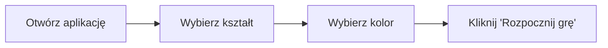

# Instrukcja Użytkowania

## 🚀 Szybki Start

### 1. Instalacja

```bash
# Sklonuj repozytorium lub rozpakuj pliki
cd "prompt haus APP"

# Zainstaluj zależności
npm install
```

### 2. Konfiguracja (Opcjonalna)

Jeśli chcesz używać prawdziwego OpenAI API:

```bash
# Skopiuj przykładową konfigurację
cp .env.example .env

# Edytuj .env i dodaj swój klucz
OPENAI_API_KEY=sk-your-api-key-here
PORT=3000
```

**Uwaga:** Aplikacja działa również bez OpenAI - używa wtedy lokalnego generatora!

### 3. Uruchomienie

```bash
# Uruchom serwer
npm start

# Lub w trybie development (auto-reload)
npm run dev
```

### 4. Otwórz w przeglądarce

```
http://localhost:3000
```

---

## 🎮 Jak Grać

### Krok 1: Wybór Kształtu i Koloru



**Dostępne kształty:**
- ⭕ Koło
- ◻️ Prostokąt
- 📏 Linia
- 🔺 Trójkąt
- ⬭ Elipsa

**Wybór koloru:**
- Kliknij color picker
- Wybierz dowolny kolor z palety

### Krok 2: Narysuj Pierwszy Kształt

1. **Kliknij i przytrzymaj** na canvas w miejscu startu
2. **Przeciągnij** myszą do miejsca końca
3. **Puść przycisk** - kształt zostanie utworzony

**Przykłady gestów:**

| Kształt | Jak rysować |
|---------|-------------|
| Koło | Przeciągnij po przekątnej - odległość = promień |
| Prostokąt | Przeciągnij tworzące przekątną prostokąta |
| Linia | Przeciągnij od początku do końca linii |
| Trójkąt | Przeciągnij - rozmiar = max(szerokość, wysokość) |
| Elipsa | Przeciągnij - szerokość i wysokość to promienie |

### Krok 3: Obserwuj AI #1 (Chaotyczne)

Po narysowaniu kształtu:

1. AI automatycznie rozpocznie generowanie
2. Zobaczysz animację "AI myśli..."
3. Co ~1.4s pojawi się nowy kształt
4. W historii zobaczysz uzasadnienia AI
5. Po 10 turach - pytanie do Ciebie

**Czego się spodziewać:**
- Losowe kolory i pozycje
- Rotacje i transformacje
- "Zaprzeczenia" poprzednim decyzjom
- Chaos i napięcie wizualne

### Krok 4: Podaj Kierunek

Po 10 turach AI #1:

1. Pojawi się pytanie od AI
2. Wpisz swój kierunek w pole tekstowe
3. Kliknij "Wyślij kierunek"
4. Kliknij "Kontynuuj" gdy będziesz gotowy

**Przykładowe kierunki:**

```
✅ Dobre odpowiedzi:
- "Więcej symetrii, zbalansuj kompozycję"
- "Dodaj ciepłe kolory, usuń chaos"
- "Stwórz wzór przypominający las"
- "Kontynuuj chaos, ale w lewym górnym rogu"

❌ Złe odpowiedzi:
- "Narysuj dom" (złożony obiekt - zabroniony!)
- "Użyj gwiazdy" (niedostępny kształt)
```

### Krok 5: Obserwuj AI #2 (Harmoniczne)

1. AI #2 weźmie pod uwagę Twój kierunek
2. Będzie dążyć do harmonii i balansu
3. Uzupełni kompozycję
4. Po 10 turach - koniec gry

**Czego się spodziewać:**
- Symetria i wzory
- Kontynuacja Twoich wskazówek
- Balansowanie kolorów
- Spójna końcowa kompozycja

### Krok 6: Zakończenie

1. Status zmieni się na "Gra zakończona!"
2. Możesz przeglądać historię wszystkich ruchów
3. Kliknij "Nowa gra" aby zacząć od nowa

---

## 🎨 Wskazówki i Triki

### Dla Początkujących

1. **Zacznij od prostego kształtu** - koło lub prostokąt
2. **Użyj jasnego koloru** - lepiej widoczny dla AI
3. **Narysuj w centrum** - daj AI przestrzeń wokół
4. **Bądź cierpliwy** - każda tura trwa ~1.4s

### Dla Zaawansowanych

1. **Eksperymentuj z pozycją** - róg vs centrum daje różne rezultaty
2. **Testuj kolory** - AI reaguje na kontrast
3. **Podawaj abstrakcyjne kierunki** - "emocja strachu" zamiast "czerwone koła"
4. **Obserwuj wzory** - AI często tworzy nieświadome sekwencje

### Debugging

**Problem:** AI nie generuje kształtów
- **Rozwiązanie:** Sprawdź console (F12) - może brak połączenia z API
- **Fallback:** Aplikacja używa lokalnego generatora

**Problem:** Kształty nakładają się
- **To feature, nie bug!** - Część chaotycznego procesu

**Problem:** Nie mogę narysować kształtu
- **Rozwiązanie:** Upewnij się, że kliknąłeś "Rozpocznij grę"

---

## 🔧 Zaawansowana Konfiguracja

### Zmiana Modelu LLM

W `server/index.js`:

```javascript
// Zmień model
model: "gpt-4-turbo-preview"  // lub "gpt-3.5-turbo"

// Zmień temperature dla różnych osobowości
temperature: personality === 'chaotic' ? 1.5 : 0.5
```

### Dostosowanie Liczby Tur

W `js/game.js`:

```javascript
this.maxTurnsPerAI = 15;  // Domyślnie 10
```

### Dodanie Własnych Kolorów

W `js/ai.js`:

```javascript
const colors = [
    '#FF6B6B',  // Czerwony
    '#4ECDC4',  // Turkusowy
    '#TWOJ_KOLOR'  // Dodaj tutaj
];
```

### Zmiana Rozmiaru Canvas

W `index.html`:

```html
<canvas id="drawingCanvas" width="1200" height="800"></canvas>
```

**Uwaga:** Pamiętaj o aktualizacji CSS!

---

## 📱 Tryb Responsywny

Aplikacja dostosowuje się do rozmiaru ekranu:

- **Desktop (>1200px):** Pełny layout z panelem bocznym
- **Tablet/Mobile (<1200px):** Stos pionowy

**Na urządzeniach mobilnych:**
- Dotyk działa jak mysz
- Kształty można rysować palcem
- Może być mniej precyzyjne

---

## 💾 Zapis i Eksport

### Zapis Canvas jako Obraz

Dodaj do kodu (opcjonalnie):

```javascript
// W game.js po zakończeniu
const dataURL = this.canvas.canvas.toDataURL('image/png');
const link = document.createElement('a');
link.download = 'ai-drawing-chaos.png';
link.href = dataURL;
link.click();
```

### Eksport Historii

```javascript
// Pobierz pełną historię jako JSON
const history = JSON.stringify(this.moveHistory, null, 2);
console.log(history);
```

---

## 🎯 Cele i Wyzwania

### Wyzwania do Spróbowania

1. **Minimalizm:** Stwórz kompozycję używając tylko jednego koloru
2. **Chaos Max:** Zobacz jak chaotyczne może być AI #1
3. **Harmonia:** Kieruj AI #2 do maksymalnej symetrii
4. **Storytelling:** Opowiedz historię przez kształty
5. **Abstrakcja:** Stwórz emocję bez konkretnego obiektu

### Przykładowe Sesje

**Sesja 1: "Las"**
- Użytkownik: Zielona linia (pień)
- AI #1: Chaos zieleni i brązu
- Kierunek: "Stwórz las bez rysowania drzew"
- AI #2: Harmoniczne linie przypominające las

**Sesja 2: "Emocje"**
- Użytkownik: Czerwone koło (gniew)
- AI #1: Eksplozja kolorów
- Kierunek: "Od gniewu do spokoju"
- AI #2: Przejście do niebieskich tonów

---

## ❓ FAQ

**Q: Czy muszę mieć API key?**
A: Nie! Aplikacja działa z lokalnym generatorem.

**Q: Jak długo trwa gra?**
A: Około 3-5 minut (zależy od Twojego tempa).

**Q: Czy mogę zmienić kształt w trakcie?**
A: Nie, wybierasz na początku. Ale możesz zrestartować grę!

**Q: Co jeśli AI robi "głupie" rzeczy?**
A: To część zabawy! Chaos jest celowy.

**Q: Czy mogę grać bez internetu?**
A: Tak, jeśli uruchomisz serwer lokalnie.

**Q: Jak dodać nowe kształty?**
A: Edytuj `shapes.js` i dodaj metodę `draw[NowyKsztalt]()`.

